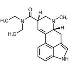

+++
title = "Deutschreportage"
date = "2023-05-31"
draft = false
pinned = false
tags = ["Deutsch", "Reportage", "LSD"]
image = "/img/strukturformel.png"
description = "Eine Deutschreportage im Auftrage vom Gymnasium Kirchenfeld"
+++
# LSD – Droge oder Therapiestoff?


LSD - Rauschmittel oder Medizin? Diese Frage haben wir uns für unsere Reportage gestellt. In unserem Interview mit Herrn Roder, Apotheker und Mitarbeiter des Pharmazeutischen Kontrolllabors in Bern, haben wir viele wichtige Fakten, aber auch Geschichten von Betroffenen erfahren.


Albert Hoffman entdeckte «LSD» im Jahre 1938, zu dieser Zeit stellte er die bekannteste Form, LSD-25, her, obwohl er zu dieser Zeit noch keine Versuche damit gemacht hatte, das kam erst fünf Jahre später. Im Frühjahr 1943 stellte Albert Hoffman erneut LSD-25 her. Vermutlich hatte er einmal versehentlich etwas davon auf die Finger bekommen. Da er danach in einen Rauschzustand verfiel und er sich das nicht anders erklären konnte, beschloss er, einen Selbstversuch zu machen. Dieser wurde mit 0,25 mg durchgeführt, was im Vergleich zu allem, was damals bekannt war, enorm wenig war. Hoffman hatte zunächst ein sehr dämonisches Bild von LSD, er erlebte zunächst nicht wirklich etwas Schönes, bevor er es genießen konnte. Deshalb war er zuerst erstaunt, dass Leute es als Rauschmittel benutzten. Er hatte damals außer stark geweiteten Pupillen keine äußeren Auffälligkeiten. Das ist auch nicht verwunderlich, wenn man sich die Wirkung genauer ansieht.

Aufgrund der Tatsache, dass schon sehr geringe Mengen LSD ausreichen, um high zu werden, unterscheidet sich die Einnahme etwas von der anderer Drogen. LSD wird entweder ganz klassisch in Pillenform konsumiert oder über Papierstücke, die in eine Flüssigkeit eingetaucht werden, in der das LSD aufgelöst wurde. Nach dem Trocknen befindet sich der Wirkstoff im Papier und muss nur noch gegessen werden.


Wie wirkt LSD? - LSD (Lysergsäurediethylamid) bindet an den Serotoninrezeptor, ist aber nicht der einzige Rezeptor, an den LSD bindet, es bindet unter anderem auch an Dopaminrezeptoren. Die Plasmahalbwertszeit beträgt etwa 3 Stunden, ein Rausch dauert jedoch zwischen 8 und 12 Stunden an, Nachwirkungen können jedoch noch einige Tage danach auftreten.


Die Wirkungen von LSD sind vielfältig, meist handelt es sich jedoch um Stressreaktionen, d.h. der Blutdruck steigt, der Puls beschleunigt sich und die Pupillen weiten sich, um nur einige zu nennen. Das sind aber nicht alle möglichen Reaktionen, es kann auch zu Übelkeit oder Krämpfen kommen. Die vermutlich tödliche Dosis dürfte jedoch weit von der wirksamen Dosis entfernt sein, es sind auch keine Todesfälle bekannt, die direkt auf LSD zurückzuführen sind, was unter anderem daran liegt, dass LSD in seiner verdaulichen Form sehr stark ist. Es gibt kaum etwas, das in so kleinen Mengen eine so starke Wirkung hat. Die Potenz kommt aber nicht von ungefähr, Albert Hoffmann hat viele sehr ähnliche Substanzen getestet. Aber außer LSD-25 waren nur wenige Varianten wirklich wirksam. LSD-25 ist keine besondere Form, es ist die Form von LSD, die wahrscheinlich hergestellt und verkauft wird. Es gibt auch andere Derivate, die erhältlich sind, aber diese sind nicht wirklich von Bedeutung, unter anderem weil sie viel weniger pychoaktiv sind. Eine der Hauptanwendungen von LSD war die Behandlung von PTSD. Diese Anwendung verschwindet jedoch immer mehr, da MDMA besser geeignet ist, aber es gibt kaum einen Grund, warum LSD nicht für diesen Zweck verwendet werden sollte.

Eine weitere wichtige Anwendung von LSD ist das Wiedererleben von Erinnerungen, was sich für den Konsumenten dann sehr real anfühlt. Allerdings ist es dann für die Person entsprechend unangenehm. Mit MDMA, das dann in naher Zukunft zur Verfügung stehen könnte, könnte es angenehmer sein.

Wenn man es alleine nimmt oder auf einer Party, in einer schlechten Stimmung, dann kann es so weit kommen wie in dem schlimmsten Fall, den Herr Roder erwähnt hat. Eine junge Frau war genau in der oben beschriebenen Situation, sie war auf einem Microdosing-Festival.

Viel interessanter als die körperlichen Wirkungen sind jedoch die psychischen Wirkungen von LSD. LSD hat eine halluzinogene Wirkung, die sich dadurch auszeichnet, dass alle Sinne viel aufnahmefähiger sind oder es sogar zu Wahrnehmungsverzerrungen kommt. Die Welt ist viel bunter und heller, außerdem werden Geräusche zu Bildern. Klingt doch alles ganz schön und interessant, oder? Das ist es auch, aber es gibt auch Schattenseiten. In der falschen Umgebung und mit den falschen Leuten kann es tödlich enden. Aber der Rausch ist nicht das Einzige, wofür man LSD gebrauchen kann. LSD kann sehr gut als Medikament eingesetzt werden, zum Beispiel kann man mit LSD Erinnerungen wiedererleben, auch wenn man sonst nur schwer an solche Informationen herankommt. Der Nachteil ist jedoch, dass das Wiedererleben sehr unangenehm sein kann. Zwar gibt es auch MDMA, das das Wiedererleben angenehmer machen soll, aber LSD wird nicht nur in der Therapie eingesetzt.

LSD kann in keiner Weise abhängig machen, weder körperlich wie Alkohol oder Heroin, noch psychisch wie Ecstasy oder Cannabis. Das einzige, was passieren kann, ist, dass man den Rausch genießt und deshalb LSD ein zweites oder drittes Mal konsumiert, aber wenn man will, sollte es nicht sehr schwer sein, damit aufzuhören.

Marc hat die ganze Thematik relativ gut zusammengefasst: 

> Ohne gute Vorbereitung, ist es wahrscheinlicher einen sogenannten Bad-Trip zu haben. – Marc Roder

LSD kann aber nicht nur als Rauschmittel verwendet werden. LSD kann sehr gut als Medikament eingesetzt werden, ein Beispiel dafür ist eine Wirkung von LSD, die es ermöglicht, Erinnerungen wieder zu erleben, auch wenn man sonst nur schwer an solche Informationen herankommt. Der Nachteil ist jedoch, dass das Wiedererleben sehr unangenehm sein kann. Zwar gibt es auch MDMA, das das Wiedererleben angenehmer machen soll, aber LSD wird nicht nur in der Therapie eingesetzt.

Risikominimierung mit LSD - Einer der wichtigsten Faktoren sind wahrscheinlich die Menschen um dich herum, denn wenn du ihnen nicht vertraust, kann es sehr schlimm enden. Andere wichtige Faktoren sind wahrscheinlich das Alter und die Eindrücke, die man hat.

In der Therapie wird LSD meist im Liegen und mit zugehaltenen Augen verabreicht, in einem solchen Setting dürfte das Risiko vernachlässigbar sein, die einzige Langzeitfolge von LSD ist die Psychose, die aber nur dann auftreten dürfte, wenn sie auch sonst aufgetreten wäre. Echte Langzeitschäden gibt es also nicht. Hinzu kommt, dass das LSD-Risiko mit zunehmendem Alter abnimmt. Eine weitere Möglichkeit, das Risiko weiter zu senken, ist die Einnahme mit Personen, denen man vertraut.

Bei der Mikrodosierung werden eigentlich nur sehr geringe Dosen eingenommen, das Ziel ist nicht ein psychedelischer Trip, sondern einfach mehr Kreativität und Optimismus zu haben. Dieses Ziel hatte wohl auch die junge Frau, doch aus Unwissenheit wurden aus den Mikrodosen normale Dosen. Unwissentlich erlebte sie einen Rausch, auf den sie in keiner Weise vorbereitet war. Auf sich allein gestellt überwältigten sie die Erlebnisse und Gefühle, sie hörte Stimmen in ihrem Kopf und hatte das Gefühl, verfolgt zu werden. Nach einiger Zeit muss sie so verzweifelt gewesen sein, dass sie sich in einem Park an einem Baum erhängte.

So etwas Schreckliches zu hören, schreckt natürlich ab, und das ist auch gut so. LSD ist und bleibt eine Droge, auch wenn viele Gemeinsamkeiten mit anderen Drogen fehlen, auch mit LSD können Unfälle passieren. Dies darf aber nicht verallgemeinert werden, da es nicht üblich ist.

LSD ist tendenziell sicherer, wenn man älter ist, außerdem ist das Risiko bei richtiger Anwendung sehr gering. Die einzige Langzeitfolge von LSD dürfte eine Psychose sein, die aber nur auftritt, wenn sie jemand anderes bekommt. Man sollte mit vertrauten Menschen zusammen sein und in guter Stimmung sein, sonst kann es im schlimmsten Fall sogar tödlich enden. Auch wenn man gut gelaunt ist, kann es passieren, dass man sich unverwundbar fühlt und unbegrenzt Freunde hat, was je nach Fall auch schädlich sein kann.

Wenn man LSD genommen hat, kann der Rausch schon lange vorbei sein, was aber nicht bedeutet, dass man nicht mehr davon betroffen ist. Gerade nach einem sogenannten “Bad Trip” kann es sein, dass man noch eine Weile damit zu kämpfen hat, diese Gefühle und Erlebnisse zu verarbeiten, da man im Rausch regelrecht überflutet wird. Dies alles zu verarbeiten kann von Stunden über Tage bis hin zu Wochen dauern. Wie in einem Fall, von dem uns Marc erzählt hat. In diesem Fall hat Herr XY nach der Trennung von seiner Freundin eine hohe Dosis genommen. Er brauchte zwei Wochen, um das Erlebte im Rausch zu verarbeiten, aber danach ging es ihm wieder gut.

Damit man einem Bad Trip vermeiden kann, sollte man LSD nur in einem in einem professionellen Setting einnehmen. Optimal wäre, wenn man es in einer ruhigen vertrauten Umgebung, wo man sich wohl fühlt, einnimmt. Weitere Dinge, die den Rausch wesentlich angenehmer machen ist, wenn man sich irgendwo hinlegt, der Raum abgedunkelt ist und man Musik hört, die einem gefällt.

Was man genau erlebt kann sehr unterschiedlich sein, es kann von einer verschlungenen Realität bis zu sehr abstrusen Dingen gehen. Es kann so weit gehen, dass man eine Gotteserscheinung sieht oder andere mythische Dinge erlebt, diese können auch dadurch entstehen, dass man sich sehr stark mit der Welt verbunden fühlt. Es kann aber auch in eine ganz andere Richtung gehen, wie ein Zitat von Marc Roder zeigt:

> Es gibt Menschen welche sich nach der Einnahme von LSD als Fötus im Bauch der Mutter sehen. – Marc Roder

Das ist etwas, was sich selbst ein Mensch mit viel Phantasie kaum vorstellen kann, und so ist es nicht verwunderlich, dass es Menschen gibt, die LSD für ihre Kreativität benutzen.

LSD kann in keiner Weise abhängig machen, weder körperlich wie Alkohol oder Heroin, noch psychisch wie Ecstasy oder Cannabis. Das einzige, was passieren kann, ist, dass man den Rausch genießt und LSD ein zweites oder drittes Mal konsumiert, aber wenn man will, sollte es nicht sehr schwer sein, damit aufzuhören.

> Der Konsum von LSD führt nicht zu kognitiven Einschränkungen, wie dies bspw. Bei langjährigem Cannabiskonsum in hohen Dosen der Fall sein kann – Marc Roder

Eine der Hauptanwendungen von LSD war die Behandlung von posttraumatischen Belastungsstörungen. Diese Anwendung verschwindet jedoch immer mehr, da MDMA besser geeignet ist, aber es gibt kaum einen Grund, LSD nicht für diesen Zweck zu verwenden.

Eine weitere wichtige Anwendung von LSD ist das Wiedererleben von Erinnerungen, was sich für den Konsumenten dann sehr real anfühlt. Allerdings ist es dann für die Person entsprechend unangenehm. Mit MDMA, das in naher Zukunft verfügbar sein könnte, könnte es angenehmer sein.

Wenn man es allein oder an einer Party, in einer schlechten Stimmung nimmt dann kann es auch so weit kommen, wie beim schlimmsten von Herrn Roder erwähnten Fall, von dem er mitbekommen hat. In genau der oben beschriebenen Lage war eine junge Frau, sie war auf einem Mikrodosingfestival.